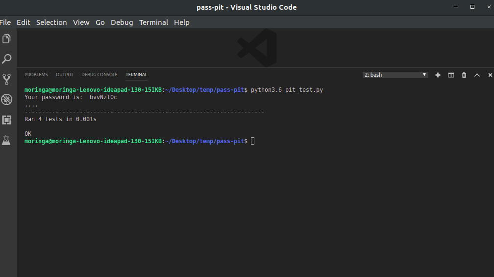

# pass-pit
pass-pit is an application that will help users manage their passwords from their various social media platforms, enable them create new accounts on other social media platforms and even generate new passwords for them, but they could use customised passwords if they wished so.

### By Sara Munini

## BDD

| Input                                       | Output  				                            |
|:------------------------------------------: | --------------------------------------------------: |		                   
| User selects sign up option                 | Their details then get saved in the list            |
| 			                                  | 			                                        | 						 		     
| Selects autogenerated password	          | choose strength of password and get output          |
| 			                                  | 			              				   		    | 
| User wants own password                     | prompted to type in custom password                 |
| 			                                  | 			                                        | 						 		 
| Sign in to pass-pit                         | incorrect input takes them to view locker           | 
| 			                                  | 			                                        | 						 		 
| User gets to add credentials                | The account is adde after they key in their detail  |
| 			                                  | 			                                        | 		

## Setup and unit test
- git clone https://github.com/Pixel-0/pass-pit.git
- cd pass-pit
- open in terminal
- run python3.6 user_test.py
Four unit tests will run successfully 

## Technologies used
- Python3.6

## For help
For any user support, contact saramunini11@gmail.com

## License
Copyright (c) {2019} Sara Munini Permission is hereby granted, free of charge, to any person obtaining a copy of this software and associated documentation files (the "Software"), to deal in the Software without restriction, including without limitation the rights to use, copy, modify, merge, publish, distribute, sublicense, and/or sell copies of the Software, and to permit persons to whom the Software is furnished to do so.